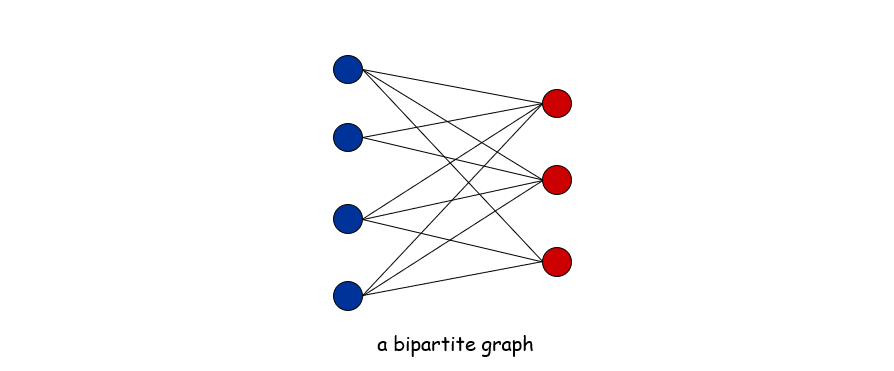
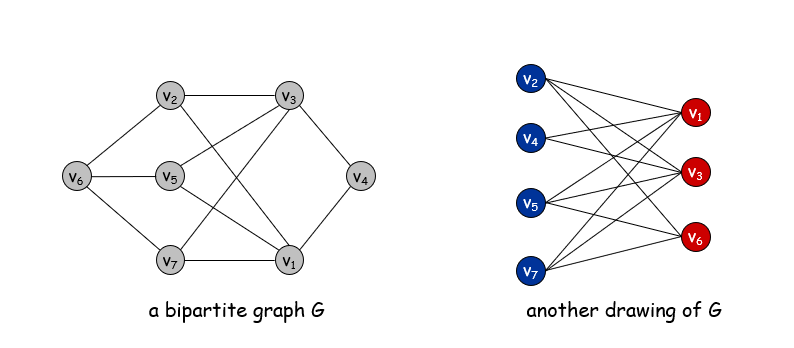
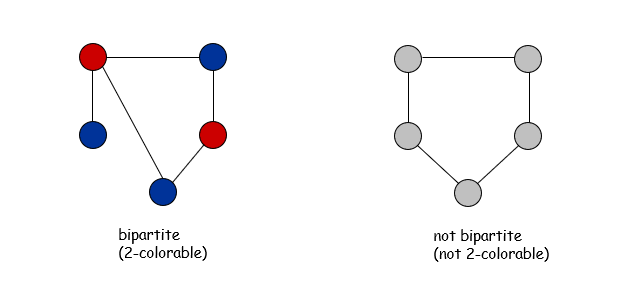
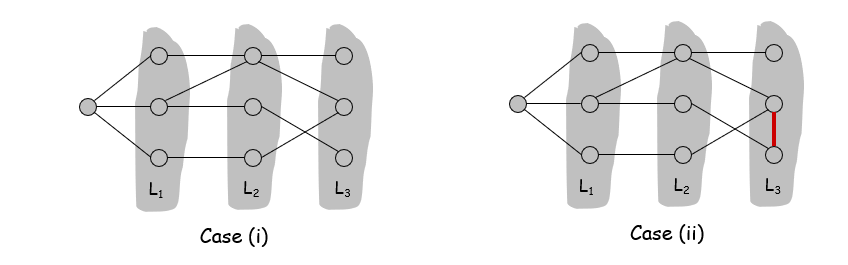
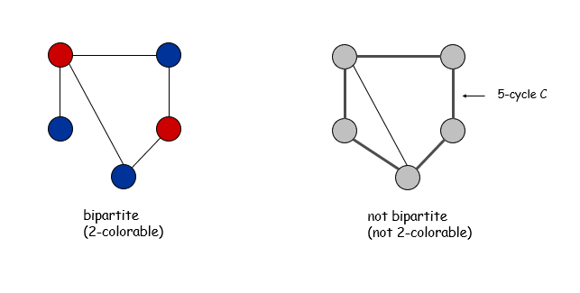

# 二部图

**Def.** An undirected graph G = (V, E) is bipartite if the nodes can be colored red or blue such that every edge has one red and one blue end. 如果图中每条边的一个端点为红色另一个为蓝色，则是二部图

**Applications.**
Stable marriage:  men = red, women = blue.
Scheduling:  machines = red, jobs = blue.

**Testing bipartiteness.**   Given a graph G, is it bipartite?
Many graph problems become:
easier if the underlying graph is bipartite (matching)
tractable if the underlying graph is bipartite (independent set)

**Lemma** 有奇圈的不是二部图。奇圈指一个圈上面含有奇数个点

**Lemma** .  Let G be a connected graph, and let L0, …, Lk be the layers produced by BFS starting at node s.  Exactly one of the following holds.
(i)   No edge of G joins two nodes of the same layer, and G is bipartite.
(ii)  An edge of G joins two nodes of the same layer, and G contains an   odd-length cycle (and hence is not bipartite).

**Corollary（推论）** .  A graph G is bipartite iff it contain no odd length cycle. 没有奇圈的是二部图。

