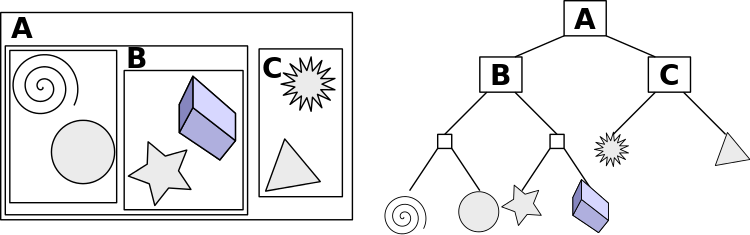

# Bounding volume hierarchy

A bounding volume hierarchy (BVH) is a tree structure on a set of geometric objects. All geometric objects are wrapped in bounding volumes that form the leaf nodes of the tree. These nodes are then grouped as small sets and enclosed within larger bounding volumes. These, in turn, are also grouped and enclosed within other larger bounding volumes in a recursive fashion, eventually resulting in a tree structure with a single bounding volume at the top of the tree. Bounding volume hierarchies are used to support several operations on sets of geometric objects efficiently, such as in collision detection and ray tracing.

Although wrapping objects in bounding volumes and performing collision tests on them before testing the object geometry itself simplifies the tests and can result in significant performance improvements, the same number of pairwise tests between bounding volumes are still being performed. By arranging the bounding volumes into a bounding volume hierarchy, the time complexity (the number of tests performed) can be reduced to logarithmic in the number of objects. With such a hierarchy in place, during collision testing, children volumes do not have to be examined if their parent volumes are not intersected.

## BVH design issues

The choice of bounding volume is determined by a trade-off between two objectives. On the one hand, we would like to use bounding volumes that have a very simple shape. Thus, we need only a few bytes to store them, and intersection tests and distance computations are simple and fast. On the other hand, we would like to have bounding volumes that fit the corresponding data objects very tightly. One of the most commonly used bounding volumes is an axis-aligned minimum bounding box. The axis-aligned minimum bounding box for a given set of data objects is easy to compute, needs only few bytes of storage, and robust intersection tests are easy to implement and extremely fast.

There are several desired properties for a BVH that should be taken into consideration when designing one for a specific application:

- The nodes contained in any given sub-tree should be near each other. The lower down the tree, the nearer the nodes should be to each other.
- Each node in the BVH should be of minimum volume.
- The sum of all bounding volumes should be minimal.
- Greater attention should be paid to nodes near the root of the BVH. Pruning a node near the root of the tree removes more objects from further consideration.
- The volume of overlap of sibling nodes should be minimal.
- The BVH should be balanced with respect to both its node structure and its content. Balancing allows as much of the BVH as possible to be pruned whenever a branch is not traversed into.

In terms of the structure of BVH, it has to be decided what degree (the number of children) and height to use in the tree representing the BVH. A tree of a low degree will be of greater height. That increases root-to-leaf traversal time. On the other hand, less work has to be expended at each visited node to check its children for overlap. The opposite holds for a high-degree tree: although the tree will be of smaller height, more work is spent at each node. In practice, binary trees (degree = 2) are by far the most common. One of the main reasons is that binary trees are easier to build.

For more details, see https://github.com/lohedges/aabbcc.