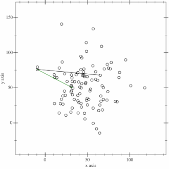

## 找出凸边形的凸边

In computational geometry, the gift wrapping algorithm is an algorithm for computing the convex hull of a given set of points.
 

    algorithm jarvis(S) is
    // S is the set of points
    // P will be the set of points which form the convex hull. Final set size is i.
    pointOnHull = leftmost point in S // which is guaranteed to be part of the CH(S)
    i := 0
    repeat
        P[i] := pointOnHull
        endpoint := S[0]      // initial endpoint for a candidate edge on the hull
        for j from 0 to |S| do
            // endpoint == pointOnHull is a rare case and can happen only when j == 1 and a better endpoint has not yet been set for the loop
            if (endpoint == pointOnHull) or (S[j] is on left of line from P[i] to endpoint) then
                endpoint := S[j]   // found greater left turn, update endpoint
        i := i + 1
        pointOnHull = endpoint
    until endpoint = P[0]      // wrapped around to first hull point

The inner loop checks every point in the set S, and the outer loop repeats for each point on the hull. Hence the total run time is {\displaystyle O(nh)}O(nh). The run time depends on the size of the output, so Jarvis's march is an output-sensitive algorithm.

However, because the running time depends linearly on the number of hull vertices, it is only faster than $O(nlogn)$ algorithms such as Graham scan when the number h of hull vertices is smaller than log n. Chan's algorithm, another convex hull algorithm, combines the logarithmic dependence of Graham scan with the output sensitivity of the gift wrapping algorithm, achieving an asymptotic running time $O(nlogn)$ that improves on both Graham scan and gift wrapping.