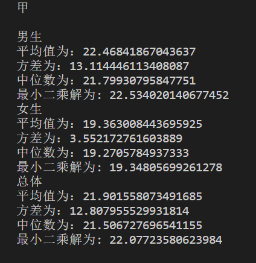
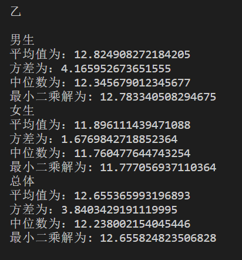
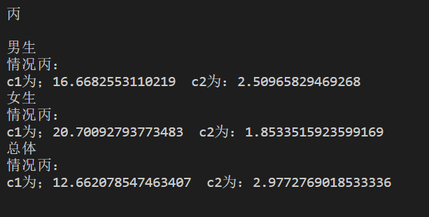
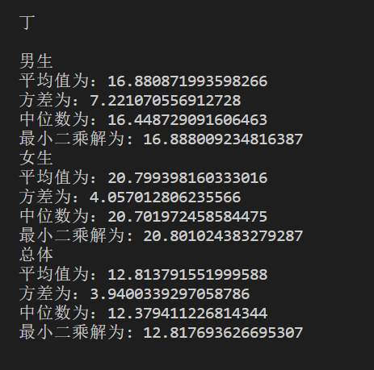
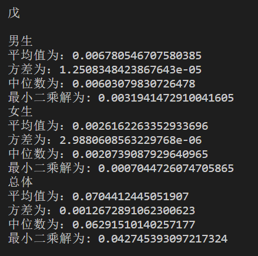

# 实验2

## 实验结果

### 甲

|   |女生|男生|全体|
|---|---|---|---|
|平均值|19.363008443695925|22.46841867043637|21.901558073491685|
|方差|3.552172761603889|13.114446113408087|12.807955529931814|
|中间值|19.2705784937333|21.79930795847751|21.506727696541155|
|最小二乘估计值|19.34805699261278|22.534020140677452|22.07723580623984|

### 乙

|   |女生|男生|全体|
|---|---|---|---|
|平均值|11.896111439471088|12.824908272184205|12.655365993196893|
|方差|1.6769842718852364|4.165952673651555|3.8403429191119995|
|中间值|11.760477644743254|12.345679012345677|12.238002154045446|
|最小二乘估计值|11.777056937110364| 12.783340508294675|12.655824823506828|

### 丙

|   |c1|c2|
|---|---|---|
|男生|16.6682553110219|2.50965829469268|
|女生|20.70092793773483|1.8533515923599169|
|总体|12.662078547463407|2.9772769018533336|

### 丁

|   |女生|男生|全体|
|---|---|---|---|
|平均值|20.799398160333016|16.880871993598266|12.813791551999588|
|方差|4.057012806235566|7.221070556912728|3.9400339297058786|
|中间值|20.701972458584475|16.448729091606463|12.379411226814344|
|最小二乘估计值|20.801024383279287|16.888009234816387|12.817693626695307|

### 戊

|   |女生|男生|全体|
|---|---|---|---|
|平均值|0.0026162263352933696|0.006780546707580385|0.0704412445051907|
|方差|2.9880608563229768e-06|1.2508348423867643e-05|0.0012672891062300623|
|中间值|0.0020739087929640965|0.00603079830726478|0.06291510140257177|
|最小二乘估计值|0.0007044726074705865|0.0031941472910041605|0.042745393097217324|

### 结果截图







## 实验丙分析

### 模型处理

所给身高体重模型为：
$$
W=c_1H^{c_2}
$$
为指数模型。所以将其线性化为：
$$
\ln W=\ln c_1+c_2\ln H
$$
令
$$
a=\ln c_1
$$

则
$$
a+\ln H \ c_2  = \ln W
$$

即
$$
\left [ \begin{matrix}
1 & \ln H
\end{matrix} \right ]
\left [ \begin{matrix}
a
\\
c_2
\end{matrix} \right ]=
\left [ \begin{matrix}
\ln W
\end{matrix} \right ]
$$

令
$$
A=\left [ \begin{matrix}
1 & \ln H
\end{matrix} \right ]
$$
$$x=\left [ \begin{matrix}
a
\\
c_2
\end{matrix} \right ]
$$
$$b=\left [ \begin{matrix}
\ln W
\end{matrix} \right ]$$

问题转化为求
$$
Ax=b
$$的最小二乘解

### 最小二乘解

要求
$$
Ax=b
$$

即求
$$
A^TA\overline{x}=A^Tb
$$
该方程的解$\overline{x}$是方程组$Ax=b$的最小二乘解

### 求解

最小二乘公式
$$
A^TAx=A^Tb
$$
可先进行QR分解，然后再求解。本次实验利用Gram-Schmidt正交分解进行QR分解

**Gram-Schmidt正交分解**
对一组向量正交化：给定一组输入的$m$维向量，找出正交坐标系统，获得由这些向量张成的空间

令$A_1,\dots,A_n$是$R^m$中的线性无关向量：
$$
y_j=A_j-q_1(q_1^TA_j)-q_2(q_2^TA_j)-\dots-q_{j-1}(q_{j-1}^TA_j)
\\
q_j=\frac{y_j}{\parallel y_j\parallel_2}
$$

记
$$
r_{jj}=\parallel y_j \parallel_2
\\
r_{ij}=q_i^TA_j
$$
则可以得出
$$
q_j=\frac{y_j}{r_{jj}}=\frac{A_j-q_1r_{1j}-q_2r_{2j}-\dots-q_{j-1}r_{j-1,j}}{r_{jj}}
$$
即
$$
A_1=q_1r_{11}
\\
A_2=q_1r_{12}+q_2r_{22}
\\
...
\\
A_j=q_1r_{1j}+\dots+q_{j-1}r_{j-1,j}+q_jr_{jj}
$$

可写为矩阵形式
$$
A_{m\times n}=Q_{m\times n}R_{n\times n}
$$
称为消减$QR$分解

代码实现：

```python
# gram-schmidt正交化
def gram_schmidt(A):
    Q = np.zeros_like(A)
    j = 0
    for a in A.T:  # 对每一个向量a
        y = np.copy(a)
        for i in range(0, j):  # 对于每个其他的维度
            y -= np.dot(np.dot(Q[:, i].T, a), Q[:, i])  # y减去在a上投影，得到正交的向量
        e = y / np.linalg.norm(y)  # 归一化
        Q[:, j] = e
        j += 1
    R = np.dot(Q.T, A)
    return (Q, R)
```

求出QR分解后

求解$A$的完全$QR$分解

$$
A=QR
$$

代入$Ax=b$，得

$$
Rx=Q^Tb
$$

即

$$
\left [ \begin{matrix}
r_{11} & r_{12} & ... & r_{1n}
\\
& r_{22} & ... & r_{2n}
\\ &  & \ddots & \vdots
\\
& & & r_{nn}
\\
0 & ... & ... & 0
\\
\vdots & & & \vdots
\\
0 & ... & ... & 0
\end{matrix} \right ]
\left [ \begin{matrix}
x_1
\\
\vdots
\\
x_n
\end{matrix} \right ]=
(q_1|\dots|q_m)
\left [ \begin{matrix}
b_1
\\
\vdots
\\
b_n
\\
b_{n+1}
\\
\vdots
\\
b_m
\end{matrix} \right ]
$$

即：

$$
\left [ \begin{matrix}
r_{11} & r_{12} & ... & r_{1n}
\\
 & r_{22} & ... & r_{2n}
\\ &   & \ddots & \vdots
\\
& & & r_{nn}
\\
0 & ... & ... & 0
\\
\vdots & & & \vdots
\\
0 & ... & ... & 0
\end{matrix} \right ]
\left [ \begin{matrix}
x_1
\\
\vdots
\\
x_n
\end{matrix} \right ]=
\left [ \begin{matrix}
d_1
\\
\vdots
\\
d_n
\\
d_{n+1}
\\
\vdots
\\
d_m
\end{matrix} \right ]
$$
$R$的下半部分皆为0，所以求
$$
\left [ \begin{matrix}
r_{11} & r_{12} & ... & r_{1n}
\\
 & r_{22} & ... & r_{2n}
\\ &      & \ddots & \vdots
\\
& & & r_{nn}
\end{matrix} \right ]
\left [ \begin{matrix}
x_1
\\
\vdots
\\
x_n
\end{matrix} \right ]=
\left [ \begin{matrix}
d_1
\\
\vdots
\\
d_n
\end{matrix} \right ]
$$
即可.

上式简写为：
$$
R\overline{x}=d 
$$
最后解出$\overline{x}$即为最小二乘解

## 代码
```python
import csv
import numpy as np
from numpy.core.fromnumeric import transpose
from numpy.core.multiarray import concatenate


#男生身高
m_H = np.loadtxt(open("numeric_analytics\lab2\man.csv",
                      encoding="utf-8"), delimiter=",", skiprows=1, usecols=(1))
#男生体重
m_W = np.loadtxt(open("numeric_analytics\lab2\man.csv",
                      encoding="utf-8"), delimiter=",", skiprows=1, usecols=(2))
#女生身高                      
w_H = np.loadtxt(open("numeric_analytics\lab2\woman.csv",
                      encoding="utf-8"), delimiter=",", skiprows=1, usecols=(1))
#女生体重
w_W = np.loadtxt(open("numeric_analytics\lab2\woman.csv",
                      encoding="utf-8"), delimiter=",", skiprows=1, usecols=(2))
#总身高
t_H = np.concatenate((m_H, w_H), axis=0)
#总体重
t_W = np.concatenate((m_W, w_W), axis=0)

# gram-schmidt正交化
def gram_schmidt(A):
    Q = np.zeros_like(A)
    j = 0
    for a in A.T:  # 对每一个向量a
        y = np.copy(a)
        for i in range(0, j):  # 对于每个其他的维度
            y -= np.dot(np.dot(Q[:, i].T, a), Q[:, i])  # y减去在a上投影，得到正交的向量
        e = y / np.linalg.norm(y)  # 归一化
        Q[:, j] = e
        j += 1
    R = np.dot(Q.T, A)
    return (Q, R)


# 求最小二乘解
def LS(_A, _b):
    b = np.matmul(transpose(_A), _b)
    # 求出QR分解
    (Q, R) = gram_schmidt(np.matmul(transpose(_A), _A))
    # 变换等式求最小二乘解
    x = np.linalg.solve(R, np.matmul(Q.T, b))
    return x

#解甲、乙、丁
def solveNormal(_power, H, W):
    # 求平均值、方差、中位数
    C = W[:]/np.power(H[:], _power)

    print("平均值为："+str(np.mean(C)))
    print("方差为："+str(np.var(C)))
    print("中位数为："+str(np.median(C)))

    # 求最小二乘解
    A = np.zeros((len(H), 1))
    A[:, 0] = np.power(H[:], _power)
    b = np.zeros((len(W), 1))
    b[:, 0] = W[:]
    x = LS(A, b)

    c = x[0][0]
    print("最小二乘解为: "+str(c))

#解丙
def solveAbNormal(H, W):
    A = np.ones((len(H), 2))
    A[:, 0] = 1
    A[:, 1] = np.log(H[:])
    b = np.zeros((len(W), 1))
    b[:, 0] = np.log(W[:])

    x = LS(A, b)
    k = x[0][0]
    c2 = x[1][0]
    c1 = np.exp(k)
    print("情况丙：")
    print("c1为；"+str(c1)+"  c2为："+str(c2))
    return c1, c2

# 求解情况戊
def solveFive(c1, H, W):
     # 求平均值、方差、中位数
    C = (np.log(W[:])-np.log(c1))/np.log(H[:])

    print("平均值为："+str(np.mean(C)))
    print("方差为："+str(np.var(C)))
    print("中位数为："+str(np.median(C)))

    b = np.zeros(len(W), 1)
    b[:, 0] = np.log(W[:])-np.log(c1)
    A = np.zeros(len(H), 1)
    A[:, 0] = np.log(H[:])

    c = LS(A, b)
    print("最小二乘解为: "+str(c))


def solve():
    print("甲\n")
    print("男生")
    solveNormal(2, m_H, m_W)
    print("女生")
    solveNormal(2, w_H, w_W)
    print("总体")
    solveNormal(2, t_H, t_W)

    print("\n")
    print("乙\n")
    print("男生")
    solveNormal(3, m_H, m_W)
    print("女生")
    solveNormal(3, w_H, w_W)
    print("总体")
    solveNormal(3, t_H, t_W)

    print("\n")
    print("丙\n")
    print("男生")
    m_c1, m_c2 = solveAbNormal(m_H, m_W)
    print("女生")
    w_c1, w_c2 = solveAbNormal(w_H, w_W)
    print("总体")
    t_c1, t_c2 = solveAbNormal(t_H, t_W)

    print("\n")
    print("丁\n")
    print("男生")
    solveNormal(m_c2, m_H, m_W)
    print("女生")
    solveNormal(w_c2, w_H, w_W)
    print("总体")
    solveNormal(t_c2, t_H, t_W)

    print("\n")
    print("戊\n")
    print("男生")
    solveNormal(m_c1, m_H, m_W)
    print("女生")
    solveNormal(w_c1, w_H, w_W)
    print("总体")
    solveNormal(t_c1, t_H, t_W)


if __name__ == "__main__":
    solve()
```
